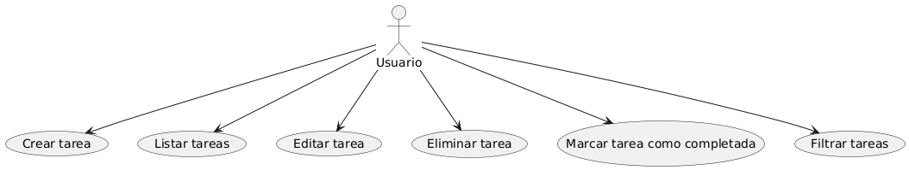
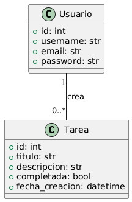
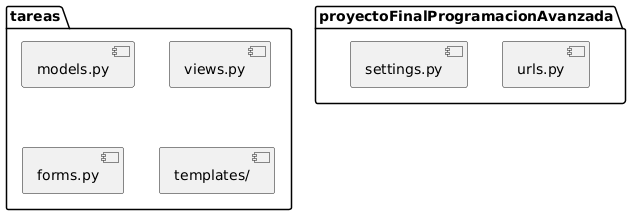
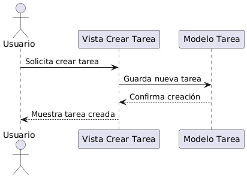
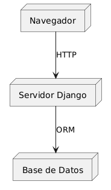
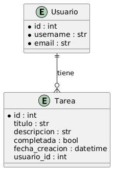

# Gestión de Tareas (Django)

Este es un proyecto integrador realizado para la materia de programación.

## 👥 Integrantes del grupo:
- Florencia Daniela Pivetta Garritano  
- Matías Ezequiel González  
- Jesica Carla Lencina  
- Nicolás Alejandro Secullini

##  Objetivo del proyecto:
Desarrollar una aplicación web para la gestión de tareas usando el framework Django, aplicando conceptos de Programación Orientada a Objetos (POO) y el patrón de diseño Modelo–Vista–Controlador (MVC).

## ⚙Tecnologías utilizadas:
- Python 3  
- Django  
- GitHub  
- Panel de administración de Django  

##  Estructura del proyecto:
- App principal: `tareas`  
- Modelo creado: `Tarea` con campos `título`, `descripción`, `completada` y `fecha_creación`
- Administración desde el panel admin

##  Patrón aplicado:
Aplicamos el patrón **MVC**, integrado en la estructura de Django:
- **Modelo**: la clase `Tarea`
- **Vista**: panel de administración
- **Controlador**: lógica interna de Django

## Estado actual:
El proyecto funciona localmente y permite crear, editar y eliminar tareas desde el panel de administración.


## Tabla de Contenidos

- [Instalación](#instalación)
- [Uso](#uso)
- [Estructura del Proyecto](#estructura-del-proyecto)
- [Modelo de Datos](#modelo-de-datos)
- [Vistas Principales](#vistas-principales)
- [Foco POO en Django](#Foco-POO-en-Django)
- [Vista de Casos de Uso](#vista-de-casos-de-uso-1)
- [Diagrama de Clases](#diagrama-de-clases-vista-lógica)
- [Diagrama de Paquetes](#diagrama-de-paquetes-vista-de-desarrollo)
- [Diagrama de Secuencia](#diagrama-de-secuencia-vista-de-procesos)
- [Diagrama de Despliegue](#diagrama-de-despliegue-vista-física)
- [Diagrama DER](#diagrama-entidad-relación)
- [Mejoras posibles para sumar al trabajo práctico](#mejoras-posibles-para-sumar-al-trabajo-práctico)


## Instalación

1. Clona el repositorio:
   ```sh
   git clone https://github.com/merii524/gesti-n-tareas.git
   cd gesti-n-tareas

2. Crea un entorno virtual e instala dependencias:
   ```sh
   python -m venv venv
   source venv/bin/activate  # En Windows: venv\Scripts\activate
   pip install -r requirements.txt
   ```
3. Realiza las migraciones:
   ```sh
   python manage.py migrate
   ```
4. Inicia el servidor:
   ```sh
   python manage.py runserver
   ```

## Uso

- Accede a `http://localhost:8000/` para ver la lista de tareas.
- Puedes crear, editar, eliminar y cambiar el estado de las tareas desde la interfaz web.
- Para acceder al panel de administración:
  1. Crea un superusuario:
     ```sh
     python manage.py createsuperuser
     ```
  2. Ingresa a `http://localhost:8000/admin/` con tus credenciales.

## Estructura del Proyecto

- `tareas/`: App principal con modelos, vistas, urls y plantillas.
- `proyectoFinalProgramacionAvanzada/`: Configuración principal del proyecto Django.

## Modelo de Datos

El modelo principal es `Tarea`:

- `titulo`: CharField
- `descripcion`: TextField
- `completada`: BooleanField
- `fecha_creacion`: DateTimeField

## Vistas Principales

- Listar tareas: `/`
- Crear tarea: `/crear/`
- Detalle de tarea: `/tareas/<id>/`
- Editar tarea: `/tareas/<id>/editar/`
- Eliminar tarea: `/tareas/<id>/eliminar/`
- Cambiar estado: `/tareas/<id>/cambiar_estado/`

## Foco POO en Django

- **Modelado de datos:**  
  El modelo [`tareas.models.Tarea`](tareas/models.py) representa una tarea como una clase, con atributos (campos) y métodos.  
  Django utiliza clases para definir modelos, formularios y vistas, promoviendo la reutilización y el encapsulamiento.


### Vista de Casos de Uso (+1)


### Diagrama de Clases (Vista Lógica)

### Diagrama de Paquetes (Vista de Desarrollo)


### Diagrama de Secuencia (Vista de Procesos)


### Diagrama de Despliegue (Vista Física)


### Diagrama Entidad-Relación



## Mejoras posibles para sumar al trabajo práctico

- Agregar **filtros** para mostrar solo tareas completadas o pendientes.
- Implementar **vistas basadas en clases** para demostrar polimorfismo.
- Agregar **autenticación de usuarios** para que cada usuario gestione sus propias tareas.
---