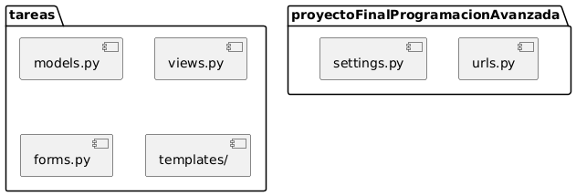
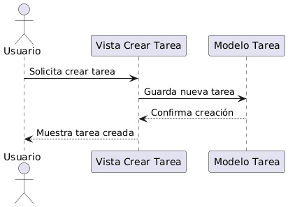
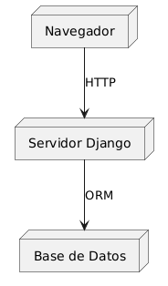
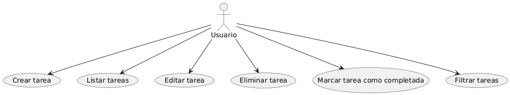
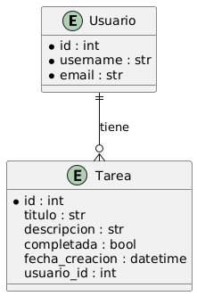

# Gestión de Tareas

Aplicación web para la gestión de tareas desarrollada con Django.

## Tabla de Contenidos

- [Descripción](#descripción)
- [Instalación](#instalación)
- [Uso](#uso)
- [Estructura del Proyecto](#estructura-del-proyecto)
- [Modelo de Datos](#modelo-de-datos)
- [Vistas Principales](#vistas-principales)
- [Contribuciones](#contribuciones)
- [Licencia](#licencia)

## Descripción

Esta aplicación permite crear, listar, editar, eliminar y marcar tareas como completadas o pendientes.

## Instalación

1. Clona el repositorio:
   ```sh
   git clone https://github.com/merii524/gesti-n-tareas.git
   cd gesti-n-tareas

2. Crea un entorno virtual e instala dependencias:
   ```sh
   python -m venv venv
   source venv/bin/activate  # En Windows: venv\Scripts\activate
   pip install -r requirements.txt
   ```
3. Realiza las migraciones:
   ```sh
   python manage.py migrate
   ```
4. Inicia el servidor:
   ```sh
   python manage.py runserver
   ```

## Uso

- Accede a `http://localhost:8000/` para ver la lista de tareas.
- Puedes crear, editar, eliminar y cambiar el estado de las tareas desde la interfaz web.
- Para acceder al panel de administración:
  1. Crea un superusuario:
     ```sh
     python manage.py createsuperuser
     ```
  2. Ingresa a `http://localhost:8000/admin/` con tus credenciales.

## Estructura del Proyecto

- `tareas/`: App principal con modelos, vistas, urls y plantillas.
- `proyectoFinalProgramacionAvanzada/`: Configuración principal del proyecto Django.

## Modelo de Datos

El modelo principal es `Tarea`:

- `titulo`: CharField
- `descripcion`: TextField
- `completada`: BooleanField
- `fecha_creacion`: DateTimeField

## Vistas Principales

- Listar tareas: `/`
- Crear tarea: `/crear/`
- Detalle de tarea: `/tareas/<id>/`
- Editar tarea: `/tareas/<id>/editar/`
- Eliminar tarea: `/tareas/<id>/eliminar/`
- Cambiar estado: `/tareas/<id>/cambiar_estado/`


# Trabajo Práctico: Aplicaciones Web con Frameworks Python

## Consigna

- **Desarrollar alguna funcionalidad o módulo interesante en una aplicación web utilizando un framework de Python (Django).**
- **Demostrar cómo la estructura del framework se basa en clases y objetos, y cómo se aplican principios de diseño orientado a objetos (POO/DOO) al construir la aplicación.**

---

## Introducción

En este trabajo práctico se desarrolló una aplicación web de gestión de tareas utilizando el framework Django. El objetivo fue aplicar conceptos de Programación Orientada a Objetos (POO) y el patrón Modelo–Vista–Controlador (MVC), aprovechando la estructura basada en clases y objetos que ofrece Django.

---

## Funcionalidad desarrollada

La aplicación permite:
- Crear, listar, editar, eliminar y marcar tareas como completadas o pendientes.
- Visualizar el detalle de cada tarea.
- Cambiar el estado de una tarea con un solo clic.
- (Opcional para sumar) **Filtrar tareas por estado** (completadas/pendientes) y **ordenar por fecha de creación**.

---

## Foco POO/DOO en Django

- **Modelado de datos:**  
  El modelo [`tareas.models.Tarea`](tareas/models.py) representa una tarea como una clase, con atributos (campos) y métodos.  
  Django utiliza clases para definir modelos, formularios y vistas, promoviendo la reutilización y el encapsulamiento.

- **Organización del código:**  
  El código está organizado en módulos (modelos, vistas, urls, plantillas), cada uno con responsabilidades claras, siguiendo buenas prácticas de diseño.

- **Herencia y polimorfismo:**  
  - Los modelos heredan de `django.db.models.Model`.
  - Los formularios heredan de `django.forms.ModelForm`.
  - Las vistas pueden ser funciones o clases (en este proyecto se usaron vistas basadas en funciones, pero se puede extender a vistas basadas en clases para demostrar polimorfismo).

---

## Ejemplo de POO en la aplicación

```python
# Modelo de datos (herencia de Model)
class Tarea(models.Model):
    titulo = models.CharField(max_length=255)
    descripcion = models.TextField(blank=True, null=True)
    completada = models.BooleanField(default=False)
    fecha_creacion = models.DateTimeField(auto_now_add=True)

    def __str__(self):
        return self.titulo

# Formulario basado en clase (herencia de ModelForm)
class TareaForm(forms.ModelForm):
    class Meta:
        model = Tarea
        fields = ['titulo', 'descripcion']
```

## Diagramas UML 4+1 y Entidad-Relación
¿Qué es el modelo 4+1 de vistas arquitectónicas UML?
El modelo 4+1 es una metodología propuesta por Philippe Kruchten para describir la arquitectura de sistemas software complejos utilizando cinco vistas complementarias. Cada vista aborda diferentes preocupaciones de los distintos actores involucrados en el desarrollo y mantenimiento del sistema. El objetivo es proporcionar una documentación clara, completa y comprensible de la arquitectura, facilitando la comunicación entre desarrolladores, usuarios y otros interesados.

Las cinco vistas son:

Vista Lógica: Se centra en la funcionalidad del sistema, mostrando la estructura de clases y objetos principales.
Vista de Desarrollo (Implementación): Describe la organización del software en módulos y componentes.
Vista de Procesos: Representa la dinámica del sistema, mostrando cómo interactúan los objetos y componentes durante la ejecución.
Vista Física (Despliegue): Muestra cómo se distribuye el sistema en el hardware y la infraestructura.
Vista de Casos de Uso (+1): Integra las otras vistas mostrando los escenarios principales de uso del sistema.

A continuación se presentan los diagramas UML y el diagrama ER que documentan la arquitectura y el modelo de datos de la aplicación.

### Diagrama de Clases (Vista Lógica)


Explicación de cada diagrama utilizado
1. Diagrama de Clases (Vista Lógica)
¿Para qué sirve?
Permite visualizar las clases principales del sistema, sus atributos, métodos y las relaciones entre ellas (herencia, asociación, composición). Es fundamental para comprender la estructura interna y el modelado orientado a objetos.

¿Qué representa en la app?
En la aplicación de tareas, muestra clases como Tarea y Usuario, sus atributos (por ejemplo, título, descripción, estado) y cómo se relacionan (un usuario puede tener muchas tareas).
### Diagrama de Paquetes (Vista de Desarrollo)


2. Diagrama de Paquetes (Vista de Desarrollo)
¿Para qué sirve?
Ayuda a entender cómo está organizado el código fuente en módulos, paquetes o componentes. Es útil para desarrolladores que necesitan navegar o modificar el código.

¿Qué representa en la app?
Muestra la estructura de carpetas y archivos de Django: el proyecto principal, la app de tareas, y cómo se agrupan los modelos, vistas, formularios, urls y plantillas.


### Diagrama de Secuencia (Vista de Procesos)


3. Diagrama de Secuencia (Vista de Procesos)
¿Para qué sirve?
Describe cómo interactúan los objetos y componentes a lo largo del tiempo para realizar una funcionalidad específica. Es útil para analizar la lógica de negocio y la comunicación entre partes del sistema.

¿Qué representa en la app?
Ejemplifica el proceso de crear una tarea: el usuario envía una solicitud, la vista procesa los datos, el modelo guarda la tarea y se devuelve una respuesta al usuario.

### Diagrama de Despliegue (Vista Física)


4. Diagrama de Despliegue (Vista Física)
¿Para qué sirve?
Muestra cómo se distribuye el sistema en la infraestructura física (servidores, bases de datos, clientes). Es útil para planificar la instalación, el mantenimiento y la escalabilidad.

¿Qué representa en la app?
Indica que el usuario accede desde un navegador web, el servidor Django procesa las solicitudes y la base de datos almacena la información de las tareas.

### Vista de Casos de Uso (+1)


Casos de Uso
Los casos de uso describen las acciones principales que los usuarios pueden realizar en la aplicación de gestión de tareas. Cada caso de uso se puede representar con un diagrama y una breve descripción.

Descripción de Casos de Uso
Crear tarea: El usuario puede agregar una nueva tarea proporcionando un título y una descripción.
Listar tareas: El usuario puede ver todas las tareas existentes, filtrarlas por estado y ordenarlas por fecha.
Editar tarea: El usuario puede modificar el título o la descripción de una tarea existente.
Eliminar tarea: El usuario puede borrar una tarea que ya no necesita.
Marcar tarea como completada: El usuario puede cambiar el estado de una tarea a completada o pendiente.
Filtrar tareas: El usuario puede ver solo las tareas completadas o solo las pendientes.

### Diagrama Entidad-Relación


5. Diagrama Entidad-Relación (ER)
¿Para qué sirve?
Permite visualizar las tablas de la base de datos, sus campos y las relaciones entre ellas. Es esencial para diseñar y comprender el modelo de datos.

¿Qué representa en la app?
Muestra las entidades Usuario y Tarea, sus atributos y la relación de uno a muchos (un usuario puede tener varias tareas).


Resumen
El uso combinado de estos diagramas permite documentar la arquitectura de la aplicación desde diferentes perspectivas, facilitando la comprensión, el desarrollo y el mantenimiento del sistema. Cada diagrama aporta una visión específica y complementaria, cubriendo tanto la estructura estática como el comportamiento dinámico y la implementación física del sistema.

---

## Mejoras posibles para sumar al trabajo práctico

- Agregar **filtros** para mostrar solo tareas completadas o pendientes.
- Implementar **vistas basadas en clases** para demostrar polimorfismo.
- Agregar **autenticación de usuarios** para que cada usuario gestione sus propias tareas.
- Permitir **subir archivos adjuntos** a las tareas.
- Agregar **tests automáticos** en [`tareas/tests.py`](tareas/tests.py).

---

## Conclusión

La aplicación demuestra cómo Django, como framework basado en POO, facilita la construcción de aplicaciones web robustas y organizadas, aplicando principios de diseño orientado a objetos en todos sus componentes.

---

**Integrantes:**  
- Florencia Daniela Pivetta Garritano  
- Matías Ezequiel González  
- Jesica Carla Lencina  
- Nicolás Alejandro Secullini